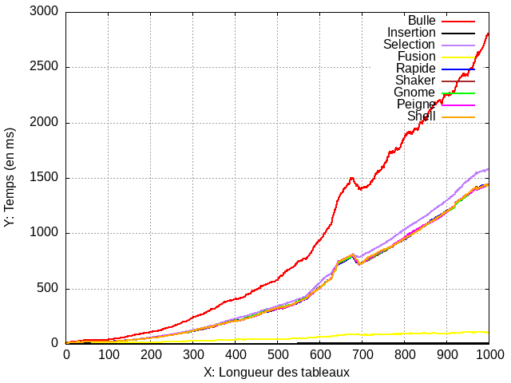
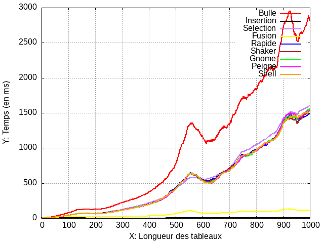
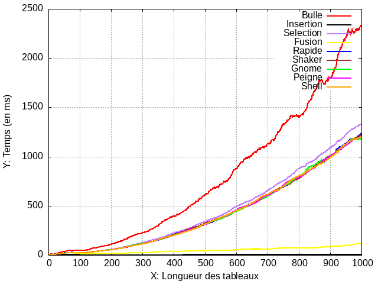

# Analyse des Algorithmes de Tri en C

Ce projet implémente divers algorithmes de tri en C et analyse leur complexité temporelle pour comparer leurs performances.

## Structure des Fichiers

- `main.c` : Le programme principal qui génère des données, effectue des tris et analyse la complexité.
- `methodetri.h` : Fichier d'en-tête contenant les implémentations __des algorithmes de tri__.
- `calcul.h` : Fichier d'en-tête contenant __remplissage du tableau__, __stockage temps dans fichiers CSV__, __execution script GNUplot__
- `plot.gnuplot` : Script Gnuplot pour générer des graphiques basés sur les données.

## Compilation et Exécution

1. Assurez-vous d'avoir `gcc` et `gnuplot` installés sur votre système.
2. Compilez le programme en exécutant :

   ```bash
   gcc -o execution main.c

3. Exécutez le programme :

    ```bash
    ./execution

4. Le programme générera des données et tracera des graphiques à l'aide de gnuplot.

### Algorithmes de Tri

- Tri à Bulles
- Tri par Sélection
- Tri par Insertion
- Tri Rapide
- Tri Fusion
- Tri Shaker
- Tri Gnome
- Tri Peigne
- Tri Shell

### Analyse des Données

Le programme génère des données aléatoires et applique divers algorithmes de tri pour mesurer leur temps d'exécution. La complexité temporelle est enregistrée et ultérieurement tracée pour analyser et comparer les performances des algorithmes.

### Tracé des Graphiques
Les graphiques sont générés à l'aide du script Gnuplot plot.plg. Le script lit les données à partir de fichiers CSV et trace des graphiques de complexité temporelle pour différents algorithmes de tri.

### Résultats

\
___Figure : Courbe qui Represente la complexite des differents Algorithmes de Trie d'un tableau Aleatoire___

\
___Figure : Courbe qui Represente la complexite des differents Algorithmes de Trie d'un tableau Asc___

\
___Figure : Courbe qui Represente la complexite des differents Algorithmes de Trie d'un tableau Desc___

### Références
Gnuplot : https://gnuplot.sourceforge.io/

### Auteur

ibtissam BENABID
[<span style="background-color:#0366d6; color:#ffffff; padding:8px 16px; border-radius:6px; text-decoration:none;">@IbtissemeBENEBID</span>](https://github.com/IbtissemeBENEBID)

